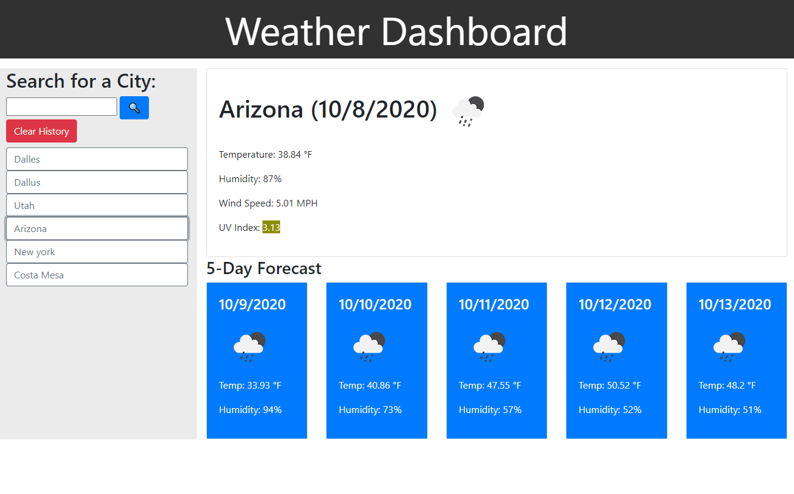

# Weather-Time

* [`Try it out for yourself here!`](https://richardmshaw.github.io/Weather-Time/)
A simple weather dashboard that displays today's weather and a 5 day forecast if which ever city you look up.

Up to 10 searched cities will be saved onto your local storage and displayed right beneath the search bar. Reloading the page will the info of the last searched city on the right. Clicking the 'Clear History' button will wipe every entry from your local storage.

You can even click them to display that city's info again.

